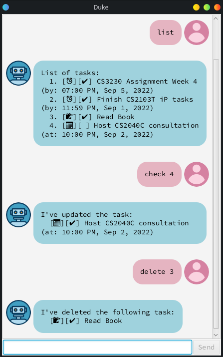

# Duke 



Duke is a personal chat-bot to help you keep track of your tasks, events, or deadlines. 
It is optimized for keyboard users, but has a GUI for the looks as well. 

## Getting Started
- Ensure you have Java 11 or above installed in your Computer.
- Download the latest jar from the [release page](https://github.com/RezwanArefin01/ip/releases/). 
- Copy the file to the folder you want to use as the home folder for your Duke.
- Make sure the directory has read and write permissions.
- Double-click the file to start the app. 
  - If it does not work try running `java -jar duke.jar` in a terminal.
- Enter `help` to get started! 

## Features 
- [x] Add a todo task. 
- [x] Add a task with a deadline. 
- [x] Add an event.
- [x] Check/uncheck a task.
- [x] Find tasks by keyword. 
- [x] Delete a task.
- [x] List all tasks.

## Commands 

### `todo <description>` - Add a todo task 
Adds a task with the given `<description>`.

**Example of usage:**
```
todo Return CLRS book to the library.
> I've added the following task:
>   [📝][ ] Return CLRS book to the library.
```

### `deadline <description> / <date> <time>` - Add a deadline task
Adds a task with the given `<description>` and a deadline specified by `<date>` and `<time>`.

**Date format** 
- Recommended: `dd-mm-yyyy`. 
- `-` may be replaced by `/`. 
- Number of digits in the day and month may be 1 or 2.
- Year may be 2 or 4 digits.

**Time format:**
- Recommended: `hhmm`.
- Alternative: `hh:mm`. 
- Number of digits in the hour and minute must be 2. 
- Hour must be in 24-hour format.

**Example of usage:**
```
deadline CS2103T iP / 16-09-2022 2359
> I've added the following task:
>   [⏰][ ] CS2103T iP (by: 16 Sep 2022 11:59 PM)
```

### `event <description> / <date> <time>` - Add an event
Adds an event with the given `<description>` and a time specified by `<date>` and `<time>`.

Date and time format is the same as the deadline command.

**Example of usage**:
```
event CS2103T lecture / 16-09-2022 1600
> I've added the following task:
>   [📅][ ] CS2103T lecture (at: 16 Sep 2022 4:00 PM)
```

### `list` - List all tasks
Lists all tasks in the task list.

**Example of usage:**
```
list
> List of tasks:
>   1. [📝][ ] Return CLRS book to the library.
>   2. [⏰][ ] CS2103T iP (by: 16 Sep 2022 11:59 PM)
>   3. [📅][ ] CS2103T lecture (at: 16 Sep 2022 4:00 PM)
```

### `check <index>` - Mark a task as done
Marks the task at the given `<index>` as done.

You may want to use the `list` command to find the index of the task you want to mark as done.

**Example of usage:**
```
check 1
> I've updated the following task: 
>   [📝][✔] Return CLRS book to the library.
```

### `uncheck <index>` - Mark a task as not done 
Marks the task at the given `<index>` as not done.

**Example of usage:**
```
uncheck 1
> I've updated the following task: 
>   [📝][ ] Return CLRS book to the library.
```

### `delete <index>` - Delete a task
Deletes the task at the given `<index>`.

**Example of usage:**
```
delete 1
> I've deleted the following task:
>   [📝][ ] Return CLRS book to the library.
list
> List of tasks:
>   1. [⏰][ ] CS2103T iP (by: 16 Sep 2022 11:59 PM)
>   2. [📅][ ] CS2103T lecture (at: 16 Sep 2022 4:00 PM)
```

### `find <keyword>` - Find tasks by keyword
Finds all tasks that contain the given `<keyword>`.
The search is case-insensitive.

**Example of usage:**
```
find cS
> Task containing the keyword "cS":
>   1. [⏰][ ] CS2103T iP (by: 16 Sep 2022 11:59 PM)
>   2. [📅][ ] CS2103T lecture (at: 16 Sep 2022 4:00 PM)
```

### `help` - Show help message
Shows a help message with a list of commands and their usage.

### `exit` - Exit the program
Exists the program with a goodbye message.

